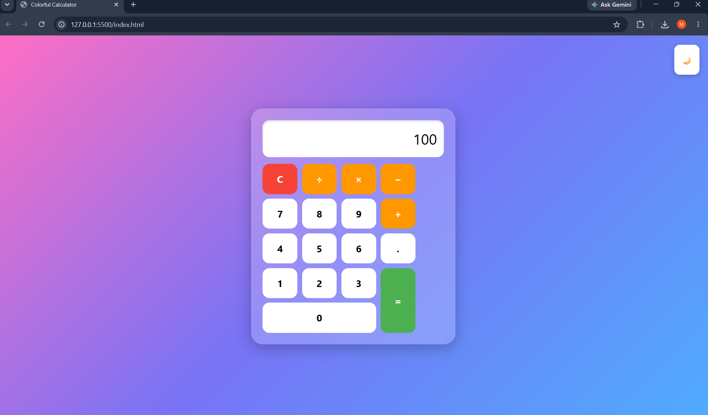
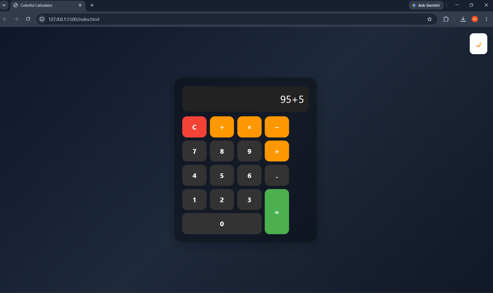

# 🧮 Calculator Project

A simple calculator built using HTML, CSS, and JavaScript.

## ✨ Features
- Basic arithmetic operations (+, −, ×, ÷)
- Real-time calculation
- Clear (AC) button
- Keyboard support
- Responsive design

## 🛠️ Tech Stack
- HTML
- CSS
- JavaScript

## 📸 Preview

### Calculator 1

### Calculator 2

## 📌 How to Use
1. Open the app in browser
2. Click buttons or use keyboard
3. Perform calculations easily

## 👨‍💻 Author
V.V.K. Mahalakshmi
